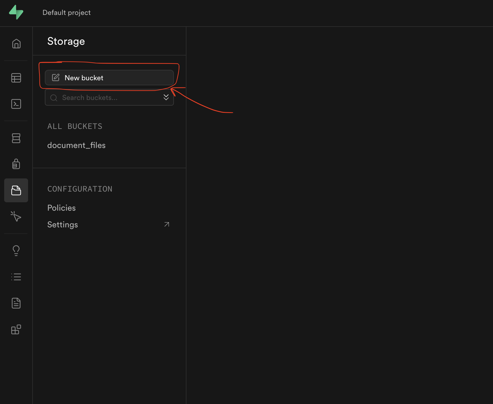

# Deployment Guide

This document outlines the steps needed to deploy the ARD Server.

## Prerequisites

- Git
- Docker and Docker Compose
- Access to server where you want to deploy
- Internet access for Supabase installation.

## Deployment Steps

### 1. Install Supabase

```bash
# Get the Supabase code
git clone --depth 1 https://github.com/supabase/supabase

# Go to the docker folder
cd supabase/docker

# Create a .env file to setup environment variables for Supabase
tocuh .env
```

### 2. Setup .env file

Copy below content to your .env file and set <YOUR_SERVER_IP_ADDRESS> to your server IP. You don't need to set the keys , as it's being set already to make it stays consistent with the Barnes Rais Backend .env file.

```bash
############
# Secrets
# YOU MUST CHANGE THESE BEFORE GOING INTO PRODUCTION
############

POSTGRES_PASSWORD=kiwekurjwiqleliqkwjeiufnhr18n32u1qeuj23nu180
JWT_SECRET=your-super-secret-jwt-token-with-at-least-32-characters-long
ANON_KEY=eyJhbGciOiJIUzI1NiIsInR5cCI6IkpXVCJ9.eyAgCiAgICAicm9sZSI6ICJhbm9uIiwKICAgICJpc3MiOiAic3VwYWJhc2UtZGVtbyIsCiAgICAiaWF0IjogMTY0MTc2OTIwMCwKICAgICJleHAiOiAxNzk5NTM1NjAwCn0.dc_X5iR_VP_qT0zsiyj_I_OZ2T9FtRU2BBNWN8Bu4GE
SERVICE_ROLE_KEY=eyJhbGciOiJIUzI1NiIsInR5cCI6IkpXVCJ9.eyAgCiAgICAicm9sZSI6ICJzZXJ2aWNlX3JvbGUiLAogICAgImlzcyI6ICJzdXBhYmFzZS1kZW1vIiwKICAgICJpYXQiOiAxNjQxNzY5MjAwLAogICAgImV4cCI6IDE3OTk1MzU2MDAKfQ.DaYlNEoUrrEn2Ig7tqibS-PHK5vgusbcbo7X36XVt4Q
DASHBOARD_USERNAME=supabase
DASHBOARD_PASSWORD=this_password_is_insecure_and_should_be_updated
SECRET_KEY_BASE=UpNVntn3cDxHJpq99YMc1T1AQgQpc8kfYTuRgBiYa15BLrx8etQoXz3gZv1/u2oq
VAULT_ENC_KEY=your-encryption-key-32-chars-min


############
# Database - You can change these to any PostgreSQL database that has logical replication enabled.
############

POSTGRES_HOST=db
POSTGRES_DB=postgres
POSTGRES_PORT=5432
# default user is postgres

############
# Supavisor -- Database pooler
############
POOLER_PROXY_PORT_TRANSACTION=6543
POOLER_DEFAULT_POOL_SIZE=20
POOLER_MAX_CLIENT_CONN=100
POOLER_TENANT_ID=admin


############
# API Proxy - Configuration for the Kong Reverse proxy.
############

KONG_HTTP_PORT=8000
KONG_HTTPS_PORT=8443


############
# API - Configuration for PostgREST.
############

PGRST_DB_SCHEMAS=public,storage,graphql_public


############
# Auth - Configuration for the GoTrue authentication server.
############

## General
SITE_URL=http://172.17.0.1:3000
ADDITIONAL_REDIRECT_URLS=
JWT_EXPIRY=3600
DISABLE_SIGNUP=false
API_EXTERNAL_URL=http://<YOUR_SERVER_IP_ADDRESS>:8000

## Mailer Config
MAILER_URLPATHS_CONFIRMATION="/auth/v1/verify"
MAILER_URLPATHS_INVITE="/auth/v1/verify"
MAILER_URLPATHS_RECOVERY="/auth/v1/verify"
MAILER_URLPATHS_EMAIL_CHANGE="/auth/v1/verify"

## Email auth
ENABLE_EMAIL_SIGNUP=true
ENABLE_EMAIL_AUTOCONFIRM=false
SMTP_ADMIN_EMAIL=admin@example.com
SMTP_HOST=supabase-mail
SMTP_PORT=2500
SMTP_USER=fake_mail_user
SMTP_PASS=fake_mail_password
SMTP_SENDER_NAME=fake_sender
ENABLE_ANONYMOUS_USERS=false

## Phone auth
ENABLE_PHONE_SIGNUP=true
ENABLE_PHONE_AUTOCONFIRM=true


############
# Studio - Configuration for the Dashboard
############

STUDIO_DEFAULT_ORGANIZATION=Default Organization
STUDIO_DEFAULT_PROJECT=Default Project

STUDIO_PORT=3000
# replace if you intend to use Studio outside of localhost
SUPABASE_PUBLIC_URL=http://<YOUR_SERVER_IP_ADDRESS>:8000

# Enable webp support
IMGPROXY_ENABLE_WEBP_DETECTION=true

# Add your OpenAI API key to enable SQL Editor Assistant
OPENAI_API_KEY=


############
# Functions - Configuration for Functions
############
# NOTE: VERIFY_JWT applies to all functions. Per-function VERIFY_JWT is not supported yet.
FUNCTIONS_VERIFY_JWT=false


############
# Logs - Configuration for Logflare
# Please refer to https://supabase.com/docs/reference/self-hosting-analytics/introduction
############

LOGFLARE_LOGGER_BACKEND_API_KEY=your-super-secret-and-long-logflare-key

# Change vector.toml sinks to reflect this change
LOGFLARE_API_KEY=your-super-secret-and-long-logflare-key

# Docker socket location - this value will differ depending on your OS
DOCKER_SOCKET_LOCATION=/var/run/docker.sock

# Google Cloud Project details
GOOGLE_PROJECT_ID=GOOGLE_PROJECT_ID
GOOGLE_PROJECT_NUMBER=GOOGLE_PROJECT_NUMBER
```

3. Start the Supabase container instances

```bash
# Pull the latest Supabase images
docker compose pull

# Start the services (in detached mode)
docker compose up -d
```

### 2. Clone the Repository of Barnes Rais Backend

```bash
git clone http://192.168.3.65:1080/mb/barnes_rais_backend.git
cd barnes_rais_backend
```

### 3. Navigate to Docker Directory

```bash
cd docker
```

### 4. Set Up Environment Variables for Barnes Rais Backend

Edit the `.env` file and update with your server information.

```bash
# Copy and create a new .env file.
cp .env.example .env

# Replace <YOUR_SERVER_IP_ADDRESS> with your server IP.
nano .env
```

### 5. Run Database Migration & Seeding (First-time Deployment)

This command will setup the database schema, tables that uses by Supabase.

```bash
docker compose -f migrate.yml --env-file .env up --build
```

If you see below logs, which means the DB schema migration is succeed.

```bash
[✓] Pulling schema from database...
docker-db-migration-1  | [✓] Changes applied
docker-db-migration-1 exited with code 0
```

#### 5.1 DB Data seeding

You need the seeding step to pre-populate some existing data into the database. This will create default users and rule sets for the application.

```bash
# Run the database seeding process
docker compose -f seed.yml --env-file .env up --build
```

If you see something like below logs, the database seeding completed successfully:

```bash
docker-db-seed-1  | 🌱 Starting database seeding...
docker-db-seed-1  | Seeding users...
docker-db-seed-1  | Users seeded successfully!
docker-db-seed-1  | Seeding ARC rules...
docker-db-seed-1  | ARC rules seeded successfully!
docker-db-seed-1  | Seeding engine model rules...
docker-db-seed-1  | ✅ Database seeding completed successfully!
docker-db-seed-1 exited with code 0
```

### 6. Setup Supabase buckets for external file managements

Open this link on the broswer, http://`<YOUR_SERVER_IP_ADDRESS>`:8000/project/default/storage/buckets. You would see the Supabase storage management console, where you can create buckets that needed for file managements by Barnes Rais Backend.
where the YOUR_SERVER_IP_ADDRESS is your server IP.

If you enter the Supabase console at the first time, you need an account and password to login Supabase. Use below account for Supabase console login.

Account: `supabase`

Password: `this_password_is_insecure_and_should_be_updated`

#### 6.1. Create a bucket named documentfiles as shown in the image.



After the bucket is created, we need to set the policies for this bucket.

#### 6.2. Create a policies to make the bucket accessible.

The bucket name is `documentfiles` instead of `document_files` shown on the image.


#### 6.3. Repeat steps 6.1-6.2 for creating other buckets if there is.

```bash
# Buckets list that needs to be created
documentfiles
```

#### 6.4. Upload files to the bucket from Barnes Rais Backend (Optional)

Curl example:

```bash
# Curl command of file uploading to the bucket (documentfiles).
curl --location --request POST 'http://<YOUR_SERVER_IP_ADDRESS>:3001/api/documents/bucket/upload' \
--form 'file=@"/path/to/po_forms_merged_01.pdf"'
```

### 7. Generate SSL certificates for HTTPS server hosting (Only needed for the deployment at the first time).

```bash
# cd to the project root folder, then run this to gen ssl keys
sudo bash gen-ssl-cert.sh
```

If it's generated successfully, you would see logs like below:

```bash
Self-signed SSL certificates generated in .ssl/ directory
- Private key: .ssl/privkey.pem
- Certificate: .ssl/fullchain.pem
```

### 8. Start the Server

```bash
# Go to the docker folder where the yaml file stays
cd docker
# Start the backend server
docker compose -f start.yml --env-file .env up --build -d
```

### 9. Check for success messages

```
# Check the backend server logs
docker logs -f barnes-rais-backend
```

If you see below logs, which menas everything has been successfully setup.

```bash
ARD Server running at https://0.0.0.0:3443
✅ Successfully connected to Supabase Auth service
✅ Successfully connected to Supabase Database, count: null
✅ Successfully connected to database from Drizzle
```

## Maintenance

For subsequent deployments (when the database schema already exists and no updates), you can skip step 5 and 6, only run step 7.

## Troubleshooting

If you encounter any issues during deployment:

1. Check Docker logs: `docker compose -f start.yml logs` or `docker barnes-rais-backend`
2. Verify environment variables are correctly set
3. Ensure database is accessible from the deployment server
